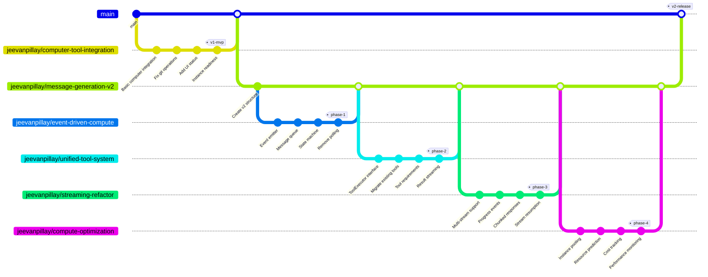

# Branch Strategy for Message Generation V2

## Overview
This document outlines the branch strategy for refactoring the message generation system to support computer-first architecture.

## Branch Graph



## Branch Descriptions

### Current Work
- **jeevanpillay/computer-tool-integration** - MVP implementation with basic computer integration

### V2 Refactor Branches

#### Parent Branch
- **jeevanpillay/message-generation-v2** - Main feature branch for V2 refactor

#### Phase Branches
1. **jeevanpillay/event-driven-compute** - Replace polling with events
2. **jeevanpillay/unified-tool-system** - Standardize all tools
3. **jeevanpillay/streaming-refactor** - Enhanced streaming capabilities
4. **jeevanpillay/compute-optimization** - Performance and cost optimization

## Development Flow

### 1. Complete Current MVP
```bash
# Current branch
git checkout jeevanpillay/computer-tool-integration
# Complete testing
# Merge to main
```

### 2. Start V2 Refactor
```bash
# Create parent branch from main (after MVP merge)
git checkout main
git pull
git checkout -b jeevanpillay/message-generation-v2

# Create phase 1 branch
git checkout -b jeevanpillay/event-driven-compute
```

### 3. Phase Development
Each phase:
1. Branch from parent (`message-generation-v2`)
2. Develop feature
3. Test thoroughly
4. PR back to parent
5. Merge to parent
6. Next phase branches from updated parent

### 4. Final Integration
```bash
# After all phases complete
git checkout main
git merge jeevanpillay/message-generation-v2
```

## Key Principles

1. **Isolation** - Each phase is isolated to minimize conflicts
2. **Sequential** - Phases build on each other
3. **Testable** - Each phase is independently testable
4. **Reversible** - Can rollback any phase if needed
5. **Incremental** - Value delivered at each phase

## Timeline

| Phase | Branch | Duration | Start | End |
|-------|--------|----------|-------|-----|
| MVP | computer-tool-integration | Complete | - | Dec 2024 |
| Phase 1 | event-driven-compute | 2 weeks | Jan 1 | Jan 14 |
| Phase 2 | unified-tool-system | 3 weeks | Jan 15 | Feb 4 |
| Phase 3 | streaming-refactor | 2 weeks | Feb 5 | Feb 18 |
| Phase 4 | compute-optimization | 2 weeks | Feb 19 | Mar 4 |
| Testing | message-generation-v2 | 2 weeks | Mar 5 | Mar 18 |

## Success Criteria

### Per Phase
- All tests pass
- No performance regression
- Backward compatibility maintained
- Documentation updated

### Overall
- 50% reduction in tool failures
- 80% better UX for long operations
- 30% cost reduction
- 2x concurrent operation throughput

## Risk Management

### Branch Conflicts
- Keep phases small and focused
- Merge frequently to parent
- Use feature flags for gradual rollout

### Rollback Plan
- Each phase can be reverted independently
- Feature flags allow instant disable
- Old system remains until fully migrated

## Related Documents
- RFC: Issue #222
- Research: Issue #221
- Current PR: #220